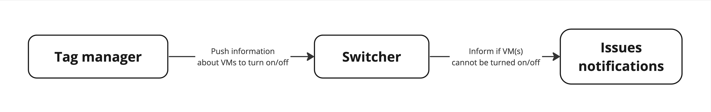
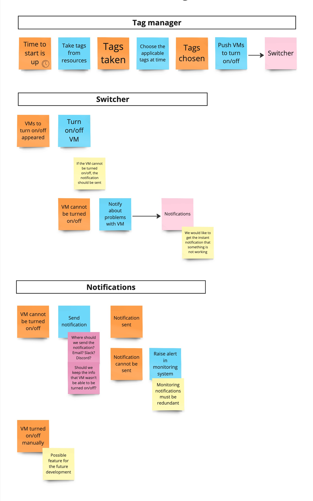
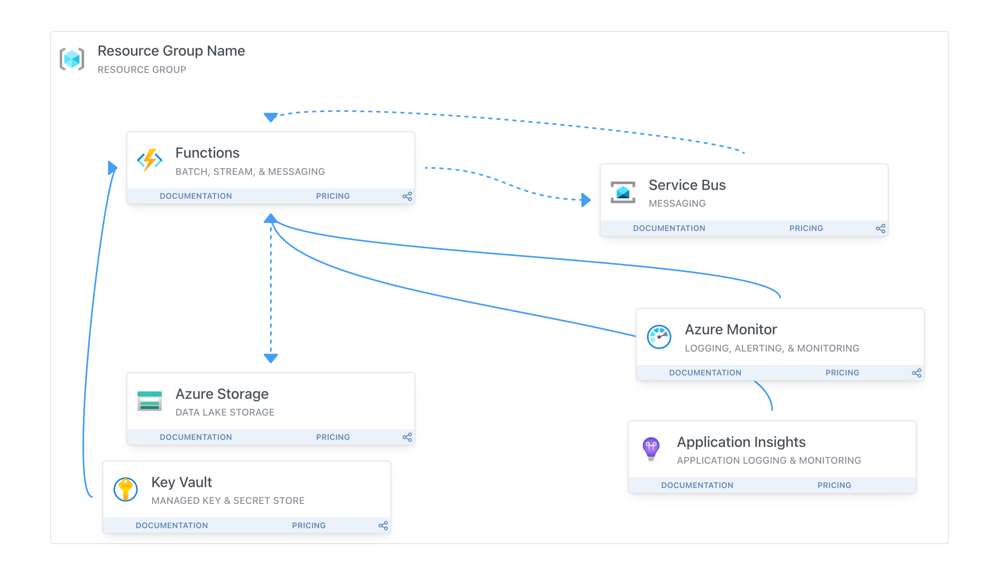
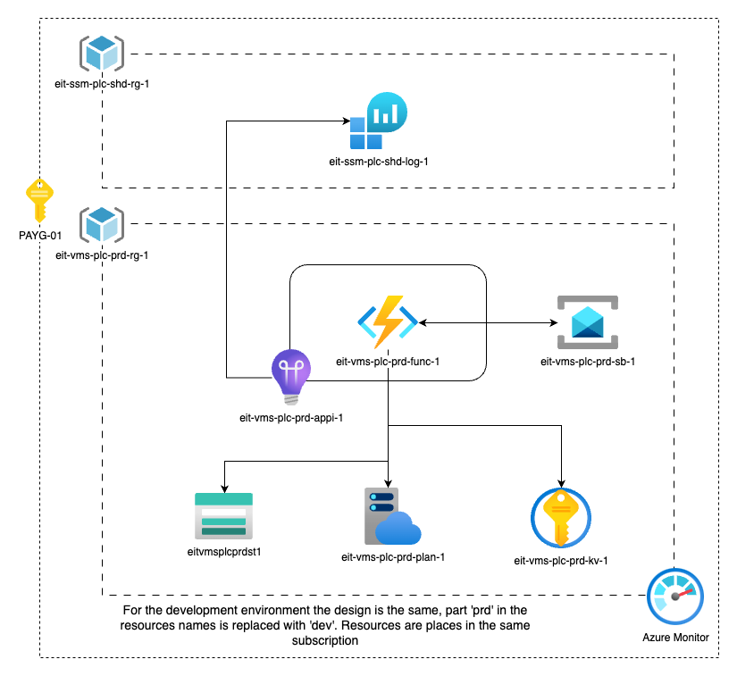

# Introduction

This repository is a part of ['100 commitów'](https://100commitow.pl/) challenge. I will work on a project for 100 days in this challenge. This project aims to have a simple solution for starting and stopping virtual machines in Azure based on the schedule. The schedule will be defined in resource tags.

# Motivation

We can save money by turning virtual machines on/off in Azure. We can turn off VMs during the night, weekends, or holidays. We can also turn on VMs during working hours. This solution can be helpful for development, testing, and staging environments.

## Example calculation

The cost of the Azure environment can be calculated with [Azure Pricing Calculator](https://azure.microsoft.com/en-us/pricing/calculator/). Of course, the end cost depends on many factors, like networking configuration, storage, etc. 

Let's assume that we have a VM with the following configuration:
- VM size: Standard D2 v5, 2 vCPUs, 8 GiB memory, 0 GiB temporary storage
- OS: Windows
- Region: Poland Central
- We are not using [Azure Hybrid Benefit](https://azure.microsoft.com/en-us/pricing/hybrid-benefit/#overview)
- We are not using [Reserved Instances](https://azure.microsoft.com/en-us/pricing/reserved-vm-instances).

Do some calculations:

- Running VM cost: €147.37/month
- If we are running the VM only 10 hours per day, 7 days per week (300h per month), the cost will be: €60.56/month - it means that we can save €86.81/month (58.8%).
- If we are running the VM only 10 hours per day, 5 days per week (220h per month), the cost will be: €44.01/month - it means that we can save €103,36/month (70%).

# Requirements

The solution needs to turn VMs on and off based on schedule within tags on the VM or RG levels. The tag on the RG level means that all VMs in the RG should be turned on/off simultaneously.
- We would avoid administrative overhead. We want to prevent secret management/rotation, manual authentication, etc.
- The solution should be monitored to see if it is working. If any problem will appear, we would like to be notified
    - Email notification
    - Slack/Discord notification
- A single solution should cover different subscriptions.
- The solution should work in 15-minute time frames.

# Existing options

We have two options to achieve this goal with the existing Azure services:
- [based on Azure Functions: Start/Stop VMs v2 overview](https://learn.microsoft.com/en-us/azure/azure-functions/start-stop-vms/overview)
- [Auto-shutdown a virtual machine](https://learn.microsoft.com/en-us/azure/virtual-machines/auto-shutdown-vm?tabs=portal)

# Design 

[Miro board](https://miro.com/app/board/uXjVNmbIwqo=/?share_link_id=652932784930)

## High-level components



## Process design



## Infrastucture design

### Diagram test on AzureDiagrams.com

In the 5th day of the challenge, I have created a diagram of the infrastructure on [AzureDiagrams.com](https://azurediagrams.com/). The diagram is available at the following link: [VM Start/Stop diagram on AzureDiagrams.com](https://azurediagrams.com/VlmwCF6o)



The tool is handy, but it has some limitations. I will use it for the initial design, but I will use another tool for the final version.

### Diagram on draw.io

The raw version of the diagram is stored in the file: `docs/assets/vm-start-stop.drawio`. 



# Resource naming convention

It is an excellent practice to have a naming convention for resources. The naming convention can help identify the resource's purpose, environment, owner, etc. It supports proper resource management and cost allocation and helps to determine the resources in the logs, monitor them, etc.

Useful links:
- [Define your naming convention](https://learn.microsoft.com/en-us/azure/cloud-adoption-framework/ready/azure-best-practices/resource-naming)
- [Naming rules and restrictions for Azure resources](https://learn.microsoft.com/en-us/azure/azure-resource-manager/management/resource-name-rules)
- [Develop your naming and tagging strategy for Azure resources](https://learn.microsoft.com/en-us/azure/cloud-adoption-framework/ready/azure-best-practices/naming-and-tagging?source=recommendations)
- [Azure Naming Tool wiki](https://github.com/mspnp/AzureNamingTool/wiki)
- [Abbreviation examples for Azure resources](https://learn.microsoft.com/en-us/azure/cloud-adoption-framework/ready/azure-best-practices/resource-abbreviations?source=recommendations)

## Azure Naming Tool

The tool installation can be found in the [documentation](https://github.com/mspnp/AzureNamingTool/wiki/Installation). The preferred way is to run it as a Docker container.

The global configuration file for the Azure Naming Tool is placed here: `src/naming-convention/globalconfig.json`.

The components configuration file for the Azure Naming Tool is placed here: `src/naming-convention/componentsconfig.json`.

# Deployment

Deployments into Azure are done with Powershell commands and scripts stored in the `src/scripts` folder.

The authorization of the GitHub Actions workflow is done with Identity Federation how it is described in the documentation: [Quickstart: Deploy Bicep files by using GitHub Actions](https://learn.microsoft.com/en-us/azure/azure-resource-manager/bicep/deploy-github-actions?tabs=CLI%2Copenid)

The deployment workflows are using:

- [Azure/powershell](https://github.com/Azure/powershell) GitHub Action,
- [Azure/login](https://github.com/Azure/login) GitHub Action.

The workflow [environments](https://docs.github.com/en/actions/deployment/targeting-different-environments/using-environments-for-deployment) were configured separately to deploy resources into the production and development environments. Also, it was required to allow connections based on federated identity from different branches. More info in the documentation [Configure a federated identity credential on an app: GitHub Actions (point 4.)](https://learn.microsoft.com/en-us/entra/workload-id/workload-identity-federation-create-trust?pivots=identity-wif-apps-methods-azp#github-actions).

In the workflow, we have also added conditional deployments to ensure that the resources are only deployed to the production environment from the main branch. More info [Using conditions to control job execution](https://docs.github.com/en/actions/using-jobs/using-conditions-to-control-job-execution).

## Splatting 

The splatting mechanism is a Powershell syntax that allows you to simplify runs of cmdlets with a significant number of parameters.

[about_Splatting](https://learn.microsoft.com/en-us/powershell/module/microsoft.powershell.core/about/about_splatting?view=powershell-7.4)

## Approved verbs

[Approved Verbs for PowerShell Commands](https://learn.microsoft.com/en-us/powershell/scripting/developer/cmdlet/approved-verbs-for-windows-powershell-commands?view=powershell-7.4)

## Role assignments

Role assignments with Bicep are described in the documentation: [Create Azure RBAC resources by using Bicep](https://learn.microsoft.com/en-us/azure/azure-resource-manager/bicep/scenarios-rbac).

The `principalId` value is an object ID of the Enterprise Application related to the service principal.

## Deployment mode

The 'Complete' mode deployment ensures that deployments manage all resources on the resource group level. More information:
- [Azure Resource Manager deployment modes](https://learn.microsoft.com/en-us/azure/azure-resource-manager/templates/deployment-modes)
- [Using linked and nested templates when deploying Azure resources](https://learn.microsoft.com/en-us/azure/azure-resource-manager/templates/linked-templates?tabs=azure-powershell)
- [Deletion of Azure resources for complete mode deployments](https://learn.microsoft.com/en-us/azure/azure-resource-manager/templates/deployment-complete-mode-deletion)

## `WhatIf` deployment check

To check the deployment before the actual deployment, the `WhatIf` parameter can be used. More information: [ARM template deployment what-if operation](https://learn.microsoft.com/en-us/azure/azure-resource-manager/templates/deploy-what-if?tabs=azure-powershell)

# Architecture Decision Records

The Architecture Decision Records (ADR) will keep a history of architectural changes. More information about ADR can be found:
- [Architecture decision record (ADR) on GitHub](https://github.com/joelparkerhenderson/architecture-decision-record),
- [Architectural Decision Records: Homepage of the ADR GitHub organization](https://adr.github.io/).

Template of ADRs: [Decision record template by Michael Nygard](https://github.com/joelparkerhenderson/architecture-decision-record/tree/main/locales/en/templates/decision-record-template-by-michael-nygard).

## [ADR001] Azure Functions Consumption plan on Windows (2024-03-24)

### Status

***`ACCEPTED`***

### Context

During the function app deployment, there was an error:

```plaintext
Requested features are not supported in region. Please try another region. (Target: /subscriptions/88a99f8e-abc3-4f87-b5d1-6582ecf72501/resourceGroups/eit-vms-plc-dev-rg-1/providers/Microsoft.Web/serverfarms/eit-vms-plc-dev-plan-1)
```

After checking the [Products available by region](https://azure.microsoft.com/en-us/explore/global-infrastructure/products-by-region/) documentation, it was found that the Azure Functions Consumption plan on Linux is not available in the Poland Central region.

### Decision

The Azure Functions Consumption plan on Windows will be deployed in the Central region of Poland.

### Consequences

It is expected to double-check if the code that runs on other platforms (like Linux) will work on Windows.

## [ADR002] Removal of the App Configuration service (2024-03-26)

### Status

***`ACCEPTED`***

### Context

During the function app deployment, there was an error:

```plaintext
10:14:29 - The deployment 'vms_20240325101322' failed with error(s).
     | Showing 1 out of 1 error(s). Status Message: The subscription has
     | reached its limit of 'configurationStores' resources with the 'free'
     | SKU. (Code:SkuPerSubscriptionLimitReached)  CorrelationId:
     | beefdcbe-5a3c-489b-bb14-a9a3795a2673
```

The error message indicates that the subscription has reached its limit of 'configurationStores' resources with the 'free' SKU. Based on the documentation, each subscription has a limit of 1 free configuration store. The App Configuration service was added to store the configuration data. Source: [Which App Configuration tier should I use?](https://learn.microsoft.com/en-us/azure/azure-app-configuration/faq#which-app-configuration-tier-should-i-use).

The App Configuration service in the Standard tier costs about 33 Euros per month.

### Decision

As the App Configuration service is not required for the current solution and the application's configuration can be handled on the function app level, it will be removed.

### Consequences

The application's configuration have to be handled on the function app level.

# Tag design

The tag can be defined at the subscription, resource group, or VM level. The tag key is the same for all levels.

The tag key is: `VM-START-STOP-SCHEDULE`.

The tag value will be created in the following way:
```plaintext
<ON/OFF>;HH:MM-HH:MM;<TIMEZONE>;<MONDAY/TUESDAY/WEDNESDAY/FRIDAY/SATURDAY/SUNDAY/WORKWEEK/WEEK/WEEKEND>
```
The denominator character is: '`;`'.

The first part defines whether the tag should apply to the scope. The value can be `ON` or `OFF`. If the value is `ON`, the tag should be evaluated. If the value is `OFF`, the tag should be ignored.

The second part defines the time range. The time range is described in the format `HH:MM-HH:MM`. The time is in the 24-hour format. The - character separates the time range. The time range defines when the VM should be turned on.

The third part defines the timezone. The timezone should be defined in the UTC/STD configuration: [IANA timezone database](https://en.wikipedia.org/wiki/List_of_tz_database_time_zones). The summertime should be applied automatically.

The fourth part defines the days when the VM should be turned on. The value can be: `MONDAY/TUESDAY/WEDNESDAY/FRIDAY/SATURDAY/SUNDAY/WORKWEEK/WEEK/WEEKEND`. The values can be connected by comma, for example: `WEEKEND,MONDAY,TUESDAY`.

# Easter eggs

There is an Easter egg for you. But this is about resting, spending time with your family, and taking care of yourself. If you are thinking about how to be a better developer, engineer, and so on, remember that you need to take care of yourself first. So, take a break, go outside, and enjoy the time with your family and friends.

# Useful materials

## Links

- [Event storming](https://www.eventstorming.com/)
- [`.gitignore` & `.git/info/exclude`](https://git-scm.com/docs/gitignore)
- [OpenID Connect](https://learn.microsoft.com/en-us/entra/identity-platform/v2-protocols-oidc)
- [GitHub Actions: About security hardening with OpenID Connect](https://docs.github.com/en/actions/deployment/security-hardening-your-deployments/about-security-hardening-with-openid-connect)
- [Workload identity federation](https://learn.microsoft.com/en-us/entra/workload-id/workload-identity-federation)
- [Workflow syntax for GitHub Actions](https://docs.github.com/en/actions/using-workflows/workflow-syntax-for-github-actions)
- [App Registration vs Enterprise Applications](https://learn.microsoft.com/en-us/answers/questions/270680/app-registration-vs-enterprise-applications)
- [Application and service principal objects in Microsoft Entra ID](https://learn.microsoft.com/en-us/entra/identity-platform/app-objects-and-service-principals?tabs=browser)
- [Products available by region](https://azure.microsoft.com/en-us/explore/global-infrastructure/products-by-region/)
- [Storage considerations for Azure Functions](https://learn.microsoft.com/en-us/azure/azure-functions/storage-considerations?tabs=azure-cli)
- [What is an Azure landing zone?](https://learn.microsoft.com/en-us/azure/cloud-adoption-framework/ready/landing-zone/)
- [Multiple function projects](https://github.com/Microsoft/vscode-azurefunctions/wiki/Multiple-function-projects)
- [REST Client VS Code extension](https://marketplace.visualstudio.com/items?itemName=humao.rest-client)
- [Quickstart: Create a C# function in Azure from the command line](https://learn.microsoft.com/en-us/azure/azure-functions/create-first-function-cli-csharp?tabs=macos%2Cazure-cli)
- [Azure Funcitions: Continuous delivery by using GitHub Actions](https://learn.microsoft.com/en-us/azure/azure-functions/functions-how-to-github-actions?tabs=windows%2Cdotnet&pivots=method-template)
- [Azure SDK for .NET overview](https://learn.microsoft.com/en-us/dotnet/azure/sdk/azure-sdk-for-dotnet)
- [Azure Functions - Part 2 - Unit and Integration Testing](https://techcommunity.microsoft.com/t5/fasttrack-for-azure/azure-functions-part-2-unit-and-integration-testing/ba-p/3769764)
- [Unit testing C# with NUnit and .NET Core](https://learn.microsoft.com/en-us/dotnet/core/testing/unit-testing-with-nunit)
- [Guide for running C# Azure Functions in the isolated worker model](https://learn.microsoft.com/en-us/azure/azure-functions/dotnet-isolated-process-guide?tabs=windows#dependency-injection)
- [Names of Classes, Structs, and Interfaces](https://learn.microsoft.com/en-us/dotnet/standard/design-guidelines/names-of-classes-structs-and-interfaces)
- [Testing with C# Dev Kit](https://code.visualstudio.com/docs/csharp/testing)
- [Design the infrastructure persistence layer](https://learn.microsoft.com/en-us/dotnet/architecture/microservices/microservice-ddd-cqrs-patterns/infrastructure-persistence-layer-design)
- [Pagination with the Azure SDK for .NET](https://learn.microsoft.com/en-us/dotnet/azure/sdk/pagination)
- [VirtualMachineCollection.GetAll Method](https://learn.microsoft.com/en-us/dotnet/api/azure.resourcemanager.compute.virtualmachinecollection.getall?view=azure-dotnet#azure-resourcemanager-compute-virtualmachinecollection-getall(system-string-system-nullable((azure-resourcemanager-compute-models-getvirtualmachineexpandtype))-system-threading-cancellationtoken))
- [Services in DDD finally explained](https://medium.com/codex/services-in-ddd-finally-explained-230b5f8a199c)
- [MediatR](https://github.com/jbogard/MediatR)
- [Configuration in .NET](https://learn.microsoft.com/en-us/dotnet/core/extensions/configuration)
- [String interpolation in .NET](https://learn.microsoft.com/en-us/dotnet/csharp/how-to/concatenate-multiple-strings)
- [Overview of Service Bus dead-letter queues](https://learn.microsoft.com/en-us/azure/service-bus-messaging/service-bus-dead-letter-queues)
- [Make HTTP requests with the HttpClient class](https://learn.microsoft.com/en-us/dotnet/fundamentals/networking/http/httpclient)
- [Azure Service Bus trigger for Azure Functions](https://learn.microsoft.com/en-us/azure/azure-functions/functions-bindings-service-bus-trigger?tabs=python-v2%2Cisolated-process%2Cnodejs-v4%2Cextensionv5&pivots=programming-language-csharp)
- [Use Key Vault references as app settings in Azure App Service and Azure Functions](https://learn.microsoft.com/en-us/azure/app-service/app-service-key-vault-references?tabs=azure-cli)
- [GitHub Action: Variables](https://docs.github.com/en/actions/learn-github-actions/variables)
- [Parameters file function for Bicep](https://learn.microsoft.com/en-us/azure/azure-resource-manager/bicep/bicep-functions-parameters-file)
- [TimeOnly.CompareTo Method](https://learn.microsoft.com/en-us/dotnet/api/system.timeonly.compareto?view=net-8.0)
- [Parse date and time strings in .NET](https://learn.microsoft.com/en-us/dotnet/standard/base-types/parsing-datetime)
- [How to use the DateOnly and TimeOnly structures](https://learn.microsoft.com/en-us/dotnet/standard/datetime/how-to-use-dateonly-timeonly)
- [NUnit: TestCase](https://docs.nunit.org/articles/nunit/writing-tests/attributes/testcase.html)
- [Selection statements - if, if-else, and switch](https://learn.microsoft.com/en-us/dotnet/csharp/language-reference/statements/selection-statements)

## Tools

- [Espanso](https://espanso.org/) - Text expander
